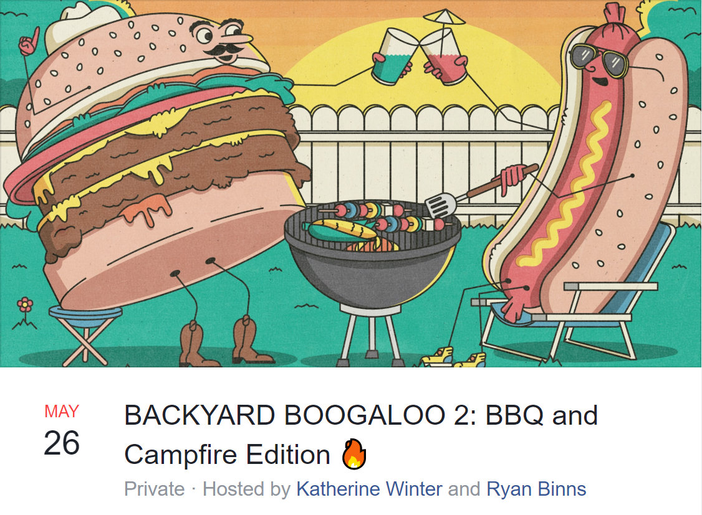
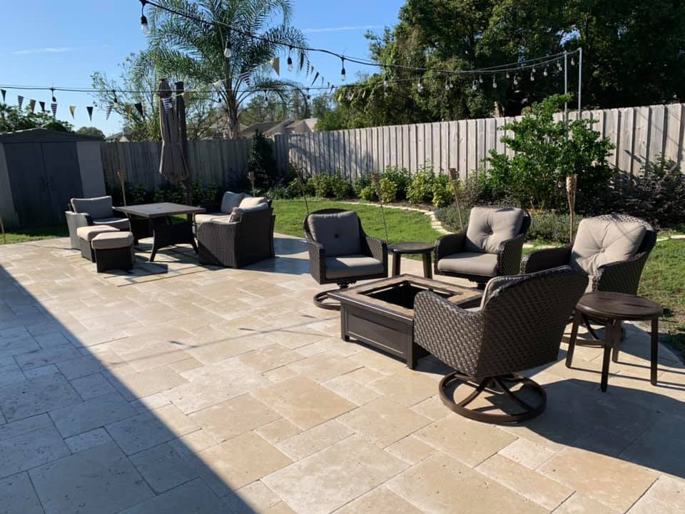

# Medium-to-Large Party Tips

Throwing a medium to large party can be intimidating. I’m going to share my experience for throwing a successful party. These are tips for 9+ guests.

## Planning the party

### Decide what kind of party it’s going to be.

The type of party it is dictates everything. It guides the food, music, drinks, and entertainment. Some basic questions:

* How many people would you like to come?
* What mixture of people should come? (Would these people have fun talking to each other?)
* What is the theme?
* What type of food should be there?
* What kind of drinks would you serve?
* What kind of music do you want?
* What kind of entertainment do you want?

These questions don’t have to be answered right away, but now is the time to start thinking about it. You will want to include this information in your invite so people will know what to expect.

### How many people would you like to come?

The party's foundation is based on how many people will attend. When deciding this, consider your avaliable space.

There are three types of parties:

* 2-6: small party. You can get away with the lot with this size
* 7-12: medium party: you have some flexibility here, mostly with food and setup. 
* 12+: large party. Have everything ready.

### What is the theme?
**Don’t worry about decorating. No really one cares. You can let the music carry the theme.**

People only care about chit chat. Decorating is only for the host ego and taking pictures. That’s not what parties are about. Stay focused on what matters.

**Themed parties**

As mentioned, don’t worry about decorating. No one cares.

Themes are all about: 
* Food
* Drinks
* Music

Unless it makes sense, don’t worry about too much about decorating. If you must decorate, you can keep it to stringed ceiling decorations (stringed lights, lanterns, flags). Table decorating gets in the way of food — unless it’s in the middle of your conversation shape. Utility props are a good addition. Such as, steins at Oktoberfest. 

Decorating is fine, but make sure you master food, drink, and music first.

Example: Flags, props, and steins -- simple but nice

### What type of food should be there?

Have more than finger food.

Talking to strangers makes people extremely hungry. For that reason, finger food is not enough. Also, having real food give another talking point. Leave out utensils and have everything well labeled. 

Make the food yourself or buy food in bulk trays from your favorite local restaurant. It’s not as expensive as you think. You can also ask your guests to pitch in. Don’t worry about hiring a catering service. Your guests can serve themselves.

### What kind of drinks would you serve?

Always: Alcohol, soda, and water. The kind of soda and alcohol is up to you.
There are a couple of ways to plan the drinks.

* Simple: Leave out soda, beer, wine, mixers, and spirits for guests to create their own drinks.
* Creative: Create drinks with your specific theme in mind.

I would advise keeping things simple. That keeps the pressure off you for keeping the special drinks in stock and made. Keep them well labeled. Empower your guest to help themselves.

Store sodas, beer, and ice in separate coolers.

Use canned beer over bottled. Bottles break easier.

### What kind of music do you want?
Create a playlist ahead of time. Make the playlist at least 6 hours long. 

Keep the music to the theme, but don’t make the music so distracting that people can’t think while they are trying to chit-chat. Make it just loud enough that if people stopped talking they could pleasantly hear the music. Never make it so loud people have to shout or speak loudly. Have music in each room, and make sure the music is synced.

Make a playlist that you can reuse for multiple parties.

[Our go-to playlist](https://open.spotify.com/playlist/7aV8SJG6GyIkRdnD7KdLy5?si=vcKt_COPSUak6YUIAg7puQ)

### What kind of entertainment do you want?

There are two types of parties: Activity party and Non-activity party

| Activity party        | Example |
| ------------- | ------------- |
| If you are going to have not chit-chat activities, make that clear in the event RSVP. Perhaps even include a schedule. Make it clear that's the schedule and what they are signing up for.  |  |

**Non-activity party**

Never create activities that you have to stop the party to begin.

It’s hard enough to go to a party where you don’t know anyone. HOPEFULLY your guest will get over the edge of being shy and start talking to fellow strangers. There is the magic. If you stop the party to play whatever stupid activity you planned, the party is ruined. Activities aren’t bonding experience. Only chit chat is.

**Passive activities**
Passive activities include fire pits, leaving simple games out (Jenga), etc.

### RSVPs
#### The time to send RSVPs

Don’t make them so far out that people can’t imagine their life then and will forget, but not so soon that people have made plans.

2-4 weeks is the sweet spot. Unless it’s a Nov and Dec holiday party, then sending months in advance is ok. People begin thinking about Nov and Dec around Sept.

Pro tip: keep a list of people you like to have at your parties to reuse. That way you can press “send” and be done.

Send reminders the day before.

| RSVP format        | Example |
| ------------- | ------------- |
| Don’t waste your money and time on paper invites. The best kind of invites can be automatically added the the persons calendar. That way it can’t get lost or forgotten as easily. Try to come up with a fun name for the party. It makes it fun to reference and more appealing to say yes to. |  |

#### Guest expectations
If it’s not a casual event, make that explicit in the invite. That’s the only time to do it. Include dinner formality (cocktail vs full dinner party). This give people time to brush up on their table manners.

| Party type  | Example |
| ------------- | ------------- |
| Activity Party |  |
| Non-activity Party |  |

### Don’t be lazy about your party. People will remember.

You are just as good as your last party. The moment people have a bad experience, they are a lot less likely to come back.

## Party setup

### Keep food and drink on opposite sides of your space.

Humans love to gather where the “resources” are. If you keep the drinks separate from the food, people will mingle in the middle. This keeps the space open for people to get refills. This is not as important the party is small. However, keeping people out of your host-responsibility way is key.

We keep our food inside, and drinks outside.

### Drinks should be set out and arranged before guests arrive.

The moment a guests arrive you will want to offer them a drink while they adjust to the new environment and gain courage. Having a drink of some sort will give them something to fidget with.

### Food can be served up to, but no later than a hour later, but try to have the food ready ahead of time.

By now, guests are good about arriving “fashionably late” for that reason, you will have some cooking time as the time ticks down. However, if you are cooking way into your party time people are going to be gathering in your kitchen, distracting you, or “wanting to help”. If the party is small, this is fine and can be nice. If it’s a large party, it’s a huge hassle. Though, you don’t want them to get restless. Drinks and snacks help with this.

### Have several comfortable seating arrangements that is in a circle-ish or box shape. 

The shape should be able to hold 4-8 people. Have more than one of these so if someone is bored they can more to the other shape. If these areas are outside, make sure it’s well shaded.

### Trash management

Keep trash clearly visible near food and drinks. Keep extra trash bags around for people to replace the bag themselves. Guests get anxious when they can’t clean up after themselves. Empower them to help themselves. I often roll up my whole outdoor trash can and leave instructions on what to do. 

### Signs for the bathroom

Post signs (printer paper and sharpie is fine) on directions to find the bathroom. You have completed your goal of no one asks where it is.

### “Don’t make me think”

Label everything. Keep soda, beer, and water in different coolers. Leave instructions for your guests on refilling snacks or drinks. Leave recycling by the drinks. Leave instructions by all trash cans about recycling.

### Clean

Clean your bathroom and sitting area before guests arrive. Put all things that your guests shouldn’t be interacting with away. They shouldn’t be looking at your body lotion or toothpaste.

### “Can I bring anything?”

No matter what you say, people are always going to bring things. Even when you explicitly say no. For that reason, just say yes. Try to go with the flow. Don’t count on them bringing anything important. They are going to be late and you won’t have what you need. This can be ok in small parties.

## During party

### Never insist that guests participate in activities.

If you must have an activity, make sure it’s purely from the consent of the guest. “Do you want to sing karaoke?” Start with one person and try to get some group consent. If you cant get enough people — DROP IT. Always have chit chat over any other activity.

### Introduce people, tell them what they have in common so you can go talk to someone else. Check back on them later.

As the host, it’s your job to keep your guests happy. You are usually the only person who knows everyone. For that reason, introduce people. Tell them why they should talk and what they should talk about. This will help with your own time management to do this with the next pair of guests, and let’s you enjoy your own party.

### Phones

Ideally you can take peoples phones away on entry. Make a game of it. Give an award to those who do. Badge of honor. Maybe a sticker that says, “phone-less and proud”. Alternatively, give them the option to choose a surprise gift. As the host you are allowed to ask people to put away their phones. They went through all the trouble of arranging the party.

