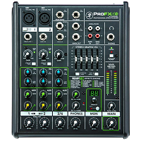
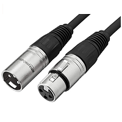
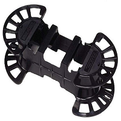

# Home Karaoke Setup

There are many at-home karaoke setup options. Here is my setup:

## My setup

| TV        |
| ------------- |
| It doesn't matter what TV you have as long as it has an HDMI port |

| Mixer        | Amazon link |
| ------------- | ------------- |
|  | [Mackie Mixer](https://smile.amazon.com/gp/product/B00VUU702A/ref=ppx_yo_dt_b_asin_title_o05_s00?ie=UTF8&psc=1) |

* Output: Stereo
* Input: Apple TV - We connect our phones and use spotify to play karaoke songs. Most people use a laptop.

| 2 Mics        | Amazon link |
| ------------- | ------------- |
|  | [2 Shure SM58S Vocal Microphones](https://smile.amazon.com/gp/product/B0000AQRSU/ref=ppx_yo_dt_b_asin_title_o02_s00?ie=UTF8&psc=1) |

| Mic cables        | Amazon link |
| ------------- | ------------- |
|  | [AmazonBasics XLR Male to Female Microphone Cable](https://smile.amazon.com/gp/product/B01JNLUMMW/ref=ppx_yo_dt_b_asin_title_o02_s00?ie=UTF8&psc=1) |

| Cable wrap        | Amazon link |
| ------------- | ------------- |
|  | [Cable wrap](https://smile.amazon.com/gp/product/B000W67G72/ref=ppx_yo_dt_b_asin_title_o01_s00?ie=UTF8&psc=1) |

## Where to find karaoke songs
* [Karafun](https://www.karafun.com)
* [Youtube](https://www.youtube.com)
* [Spotify](https://www.spotify.com)
* [Creating songs from lrcmaker.com](https://www.lrcmaker.com)

## How to play karaoke songs
Connect a laptop or Apple TV to the mixer. From the mixer you can modify the audio input and mic input

## Why should I get a mixer?
A mixer allows you to manipuate the input audio and add reverb to your voice. It makes anyone sing voice soung a bit better.
