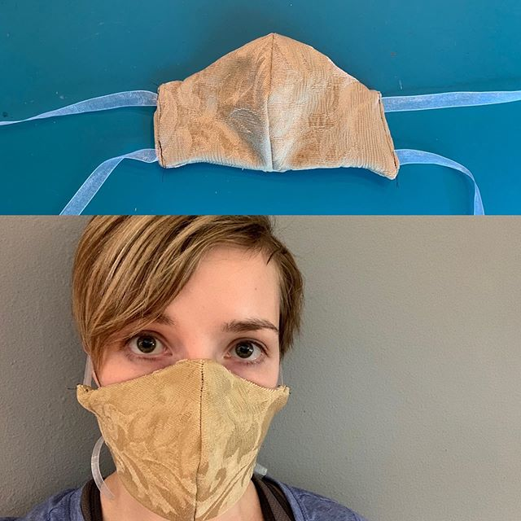

## Mask

[Mask pattern](mask.pdf)

[Tutorial video](https://www.youtube.com/watch?v=q0plBn20ICo)

These masks are not N-95 grade. The CDC advised people to make their own makes and wear them to help prevent the spread. This is not complete protection. Continue to practice social distancing.

I modified the pattern originally from [Instructables](https://www.instructables.com/id/DIY-Cloth-Face-Mask/?fbclid=IwAR2grS9NWWH5bP6iVvhpfmUuLjz_BRoc292b63X3O-zq0KqWZDxsvIantZc). After making a few of them the Instructables way, I felt my way of tucking in the sides, and using 4-16in strings easier.
