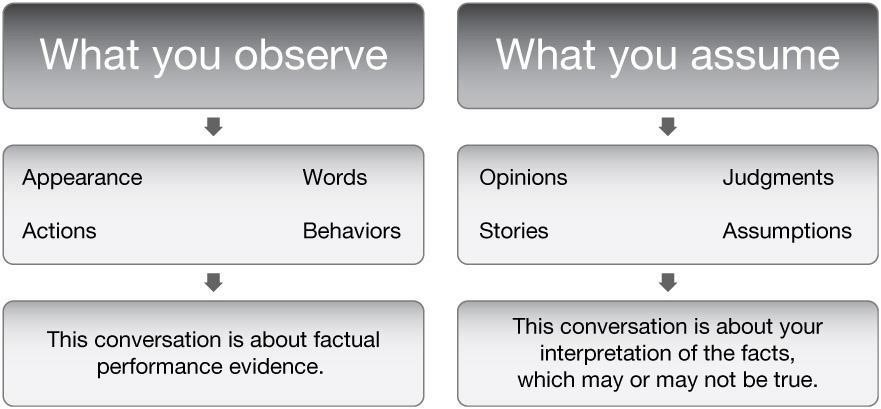

# Giving Feedback

In the realm of professional development, providing feedback is a critical component. Yet, balancing constructive and critical elements can be a delicate task. This article delves into the complexities surrounding feedback, dissecting various methods, timing, and strategies that ensure it is both effective and well-received. It explores everything from the structure of formal feedback to the art of delivering crucial, unsolicited feedback, all with an aim to offer a comprehensive understanding of best practices in corporate communication.

A quick note before we proceed - while the principles discussed here are universally applicable, their implementation may vary depending on cultural context. I'm an American, and this article is primarily rooted in the practices common in the United States, typically a low-context culture. For instance, in high-context cultures such as those prevalent in Japan, feedback tends to be less explicit and direct. Adapting the principles discussed in this article to align with the cultural norms in your specific professional environment is crucial. For the purposes of this discussion, let's explore the topic from a low-context cultural perspective, keeping in mind the need to adapt and adjust as necessary for different cultural contexts and recipient preferences.

## Giving Formal Feedback
Corporations typically have an annual or bi-annual feedback cycle. Often the feedback request is vague or blank. In this case, try the format "The Good, Opportunities, and Overall." This format usually covers all bases of what people sought but didn't ask. You will look like a feedback superhero. Under each section, start a bulleted list of everything you think of when you think of the person. Once the list is complete, try to put it in sentence form.

**Fictional example**

THE GOOD

You did an excellent job in meetings this week. When Sandra seemed confused about the expectations for the project, you did a fantastic job, of course, correcting the situation. I liked how you asked her about her current understanding of the project before trying to guide her. That shows artful skills in emotional intelligence.

OPPORTUNITIES

You get excited about projects and execute them very quickly. You could improve our organization and multiply your efforts by documenting as you go along. That way, if you are on PTO, we are entirely covered. It is an excellent opportunity to show your leadership skills by making leaders out of others.

OVERALL

You are an AWESOME teammate. I love how you care about the success of this project. That excitement is contagious!

## Strategies for Giving Crucial Feedback
Giving crucial feedback is always challenging. Below are a few tips on the approach to creating a productive conversation:

1. Consider the culture of the person you are giving feedback to. Are they used to high-context cultures? What is the 'power-distance' in the culture? Check out the [Hofstede Insights Country Comparison Tool](https://www.hofstede-insights.com/country-comparison-tool) to prepare for the conversation, which gives a studied difference in cultural differences between two countries. Understand the cultural background and norms when planning your strategy. (Again, this article is targeted at low-context cultures).
1. Consider the needs of the other person. Neurodiversity individuals have different ways of processing feedback. Everyone has a different learning style. Consider learning their style and tailoring the conversation.
1. Be clear about the desired outcome of the conversation. Don't give special treatment to an employee.
1. Slow down the pace of the conversation — it helps you find the right words and signals to your counterpart that you’re listening.
1. Don't be afraid of silence during the conversation. Don't jump in with filler comments because you are uncomfortable. The silence will give the other person time to reflect on the information and come back with their perspective. You will learn more about the situation and the other person. “If your counterpart has stopped responding to you, you can simply say, 'I don’t know how to interpret your silence.'” [(Carmichael, 2010)](https://hbr.org/2010/10/difficult-conversations-9-common-mistakes)
1. Stay focused on the issue and future results. Do not sugarcoat the information. Keep the conversation focused on the impact or business needs. Talking about the actions needed to achieve the future keeps the conversation positive. Focusing on the future may also keep the other person motivated.
1. Keep emotion in check. Rather than channeling your emotion, instead, label it. E.g., "I felt frustrated by X." On the same coin, mention it if you see them channeling emotions. E.g., "You seemed concerned about X; would you tell me more?"
1. Conduct the conversation in a new space. Going offsite and away from the working environment may create a safer neutral space.
1. If possible, have the conversation face to face rather than over chat or email. Seeing the person's expressions ensures you are on the same page.
1. Change your mindset. Don't label the conversation as difficult, but a normal conversation about growth.
1. Don't build a script. The conversation may take an unexpected turn, and you may be caught off guard and come across as artificial. Be ready for multiple responses. The language should be clear, direct, and neutral.
1. Keep an open mind. The other person will have a different perspective on the situation. "What is the problem? What does the other person think is the problem? If you aren’t sure of the other person’s viewpoint, acknowledge that you don’t know and ask.” [(Knight, 2015)](https://hbr.org/2015/01/how-to-handle-difficult-conversations-at-work)
1. Document the feedback given and the result. Hopefully, you will not need it for later, but you never know.

### Assessing the Relationship Before Giving Feedback (care/candor checklist)

Don't avoid having a crucial conversation if you have a working relationship with someone or have a stake in their development. However, if neither is the case, consider if you are the best person to have a candor conversation with. Giving feedback to someone who didn't know me or my intentions and whose situation I didn't understand has burnt me before. For that reason, I do follow the care/candor checklist that is outlined in the book The 5 Levels of Leadership and listed on [Maxwell's (2010)](https://www.johnmaxwell.com/blog/for-leaders-balancing-care-with-candor/) website:

1. Have I invested enough in the relationship to be candid with them?
1. Do I truly value this person?
1. Am I sure this is their issue and not mine?
1. Am I sure I am not speaking up because I feel threatened?
1. Is the issue more important than the relationship?
1. Does this conversation clearly serve their interests and not just mine?
1. Am I willing to invest time and energy to help them change?
1. Am I willing to show them how to do something, not just say what is wrong?
1. Am I willing and able to set clear, specific expectations?

### Feedback Formula

Usually, crucial feedback is unprompted and must be timely to be effective. However, there is a simple formula to make the experience more accessible. The following are ideal steps for feedback success:

1. Think to yourself, "Is this the right time for feedback? Why am I giving them feedback now? Do I have the relationship to have a candor conversation with this person? Is this a pet peeve or having a real performance impact?" If you have a pet peeve, make that clear.
1. Ask if the other person is open to feedback before giving the feedback.
1. Lead with behavior: Have a specific behavioral example. Do not confuse behavior with attitude. Behaviors are a person's actions and reactions towards others or situations. Attitudes are ways of thinking or feeling about a topic.
1. Eliminate judgment: Give evidence-based feedback. Focus on the gap between the expectation and actual performance.
    * Judgment - "Your document was unfinished and messy."
    * Evidence - “The document you committed to completing this sprint has pending comments. There is missing information from X service.”
    * If there isn't an explicit expectation to measure a gap, ensure not to make the feedback personal (i.e., phrase it as how this was not about them, but about you, "The way X impacted me.." or "This is less about you, but more about how I took X situation… "). Remember, this may not be how they see themselves or others see it. It is how it landed with you or the team.
1. Be clear: Identify how it impacted you/the team.
1. Be clear: Be specific about what you want to see - generate the feedback to hit all of these points: Timely, Actionable, Specific, and Kind (TASK).
1. Inquire with a purpose: Ask them for their perspective by asking an open-ended question. Stay quiet, have empathy, and listen. Do not say, "you should" or "you need to". Pay attention to their body language and tone of voice. The goal is to understand what is important to them and to understand their point of view. As mentioned, your perspective is not their perspective. The open-ended question will open the conversation, create commitment from the other person, and may prevent the person from being defensive. Examples of questions:
    * How do you feel?
    * What do you think?
    * What do you suggest in this situation?
    * 5Whys technique--Asking 'Why' questions five times to attempt to unearth a counter-measure.
1. Collobarate and agree on the summary, next steps, and timeline of follow-up.

The following is a fictional example of applying the formula:

**Me:** “Hi Ryan, are you open for feedback?”
**Ryan:** “Yes”
**Me:** “I want to give you this feedback because I value our relationship and want us to be aligned in conversations moving forward. This feedback concerns my perception, not you, but during the bug bash and this morning, I have been reading your responses as a little more defensive than curious. For example, when I asked if we had any logging on why a game didn't download during the bug bash, you said no and swiftly moved on to another topic. I didn’t feel you were open to hearing why we might find that valuable or having my concern resolved.

Slowing down in conversations would open up the floor for people like myself to express their opinions. Before moving on to another topic, please give me a moment to say my POV and why I believe it is crucial. Then help me understand your POV or what missing information I have. What are your thoughts?”

## Receiving Feedback

Just as important as giving feedback is the art of receiving feedback. The same cultural, neurodiversity and personal factors apply, and it's just as crucial to be an effective recipient of feedback as it is to give it. As described above, giving feedback is also challenging and uncomfortable for the giver. Therefore, keep an open mind and view it as a gift. Just like a gift, you don't have to do anything with the feedback, but there may be consequences for not accepting it. Therefore, agreeing on the summary, next steps, and follow-up timeline is crucial. [Friedman (2016)](https://hbr.org/2016/01/defusing-an-emotionally-charged-conversation-with-a-colleague) has a great article on handling emotionally charged conversations and utilizing the PEARLS approach. The report points out that discussions can escalate quickly when we mix task and relationship channels.

“Task-focused disagreement becomes contaminated with concerns about our relationship. And when that happens, things escalate. Fast.”

The article describes the Partnership, Empathy, Acknowledgment, Legitimation, and Support (PEARLS) approach for handling emotionally charged:

* **Partnership:**
  * “I really want to work on this with you.”
  * “I bet we can figure this out together.”
* **Empathy:**
  * “I can feel your enthusiasm as you talk.”
  * “I can hear your concern.”
* **Acknowledgment:**
  * “You clearly put a lot of work into this.”
  * “You invested in this, and it shows.”
* **Respect:**
  * “I’ve always appreciated your creativity.”
  * “There’s no doubt you know a lot about this.”
* **Legitimation:**
  * “This would be hard for anyone.”
  * “Who wouldn’t be worried about something like this?”
* **Support:**
  * “I’d like to help you with this.”
  * “I want to see you succeed.”

## Overall

In conclusion, giving and receiving feedback is critical to professional growth and development. No matter the feedback type, it demands a thoughtful, insightful, and well-structured approach. However, it's important to remember that the art of feedback is a nuanced skill that requires practice and continuous learning. As we expect growth from those receiving feedback, we, too, must strive to evolve as effective feedback providers.

Now, it's your turn to bring these insights to life. Use one technique from this guide in your next feedback session. Don't shy away from those difficult conversations. Instead, embrace them as unique opportunities for mutual growth and improved communication. Remember, each feedback session is a step toward mastering this vital professional skill.

So, why wait? Start reshaping your feedback strategy today. Step into your next feedback session with a renewed perspective and watch as it transforms into a productive, insightful, and growth-inspiring conversation.

**References**

* Friedman, R. (2016, January 12). *Defusing an Emotionally Charged Conversation with a Colleague.* Harvard Business Review. Retrieved July 22, 2023, from https://hbr.org/2016/01/defusing-an-emotionally-charged-conversation-with-a-colleague
* Green, S. (2010, October 12). *Difficult Conversations: 9 Common Mistakes.* Harvard Business Review. Retrieved July 22, 2023, from https://hbr.org/2010/10/difficult-conversations-9-common-mistakes
* Hofstede Insights. (n.d.). *Country comparison tool.* Hofstede Insights. Retrieved July 22, 2023, from https://www.hofstede-insights.com/country-comparison-tool
* Knight, R., & Dillon, K. (2015, January 9). *How to Handle Difficult Conversations at Work.* Harvard Business Review. Retrieved July 22, 2023, from https://hbr.org/2015/01/how-to-handle-difficult-conversations-at-work
* Maxwell, J. (2010, December 20). *For leaders: balancing care with candor.* Maxwell Leadership. Retrieved July 22, 2023, from https://www.johnmaxwell.com/blog/for-leaders-balancing-care-with-candor/

**Suggested reading:**

* [Feedback Buddies](https://blog.polleverywhere.com/feedback-buddies/): A model for feedback between peers.
* [Crucial Conversations](https://www.amazon.ca/Crucial-Conversations-Talking-Stakes-Second/dp/1469266822): An excellent book discussing more tactics on giving cruical conversations.

# Appendix

## Behavior vs. Attitudes*

Green, M. E. (2013). Painless performance conversations: A practical approach to critical day-to-day workplace discussions. Hoboken, NJ: John Wiley & Sons.

## Cultural Deltas

There are many strategies to take when dealing with employees with different cultural perspectives. Glassdoor (2019) suggests the following approach:

1. Learn to recognize communication gaps.
1. Evaluate your communication style.
1. Learn to identify challenges while being culturally sensitive. 
1. Continue working toward development.

Regarding items 1 & 2, ask and learn the other person about their preferences in communication. Reflect when something seems amiss. Are you avoiding having a conversation with the person? Does the other person have missing information? Reflect on your preferences; do you prefer low or high-context communication?

Regarding items 3 & 4, consider doing cross-cultural training or research after learning about the other person's preferences. Continue to build a growth mindset. The internet has many resources, and some experts can help unpack any uncomfortable deltas. Remember, the person you are trying to communicate with isn't responsible for educating you.

Glassdoor Team. (2021, June 29). High Context Culture: What Does It Mean and How to Adapt. Glassdoor. Retrieved July 30, 2023, from https://www.glassdoor.com/blog/guide/high-context-culture/

## Communication is fundamental to building trust

Self-Assessment: Are you a Communications Champion?

Do a quick and easy self-assessment to assess whether you're a Communications Champion. Periodically ask yourself seven simple questions and tabulate your score. Track the ups and downs at the end of each business quarter. Indicate your personal score using a scale of 1 to 10, where 1 is the extreme low and 10 is the extreme high.

1. I "walk the talk" by championing open communication in my company/organization. Strongly disagree 1 2 3 4 5 - Agree somewhat - 6 7 8 9 10 Strongly agree
2. When I consider the communication strategies and activities implemented by communication staff, how actively involved am I in those appropriate to my position? Not at all involved 1 2 3 4 5 - Somewhat involved - 6 7 8 9 10 Totally involved
3. How often do I meet with staff to ensure I have regular dialogue with employees? Never 1 2 3 4 5 - Sometimes - 6 7 8 9 10 As a regular priority
4. How seriously do I consider acting on the feedback I get from employees? Not at all seriously 1 2 3 4 5 - Somewhat seriously - 6 7 8 9 10 Extremely seriously
5. Am I always truthful about the information I share with staff about our mission, vision, and strategy? Never 1 2 3 4 5 - Most of the time - 6 7 8 9 10 Always
6. How certain am I that I help ensure staff understand the essential information they need to know about the direction of our company/organization? Not at all certain 1 2 3 4 5 - Somewhat certain - 6 7 8 9 10 Completely certain
7. How much do employees trust me? Not at all 1 2 3 4 5 - Somewhat - 6 7 8 9 10 Totally

Add up the numbers from your seven responses to determine your total score, then review the rating scale below to identify your communication rating:
60 to 70 = Communication Champion
50 to 59 = Good communicator but could be better
35 to 49 = Communicator with good intentions who needs to improve
07 to 34 = Poor communicator who must change behavior

Check-up: Are you creating an open communications culture in your organization?

Organizations as well as individuals benefit from regular self-assessment. To assess whether you have the systems and processes in place to create an open communications culture, consider these questions:

1. Do we have a communications policy to ensure we all understand the importance, accountability and process of communications in our organization?
2. Do the communications in our organization support our mission, vision and strategy?
3. Is our head of communications involved in corporate strategic planning?
4. Are our internal and external communications consistent and transparent?
5. Do we regularly measure the effectiveness of our communications with our key stakeholders?
6. Are our managers formally assessed and rewarded for their communications effectiveness?
7. Do we provide skills development for our managers to help them become good communicators?

Integrating mission and vision, policy and strategy, program and process, these critical success factors synergize to help build and sustain trust with multiple stakeholders.

Beslin, R., & Reddin, C. (2004). How leaders can communicate to build trust. Ivey Business Journal (Online), https://ezproxy.snhu.edu/login?qurl=https%3A%2F%2Fwww.proquest.com%2Ftrade-journals%2Fhow-leaders-can-communicate-build-trust%2Fdocview%2F216174340%2Fse-2%3Faccountid%3D3783

## When feedback goes wrong

“I explained myself poorly. These are the outcomes I want. I see X space where we can improve this. Let’s work together.”
