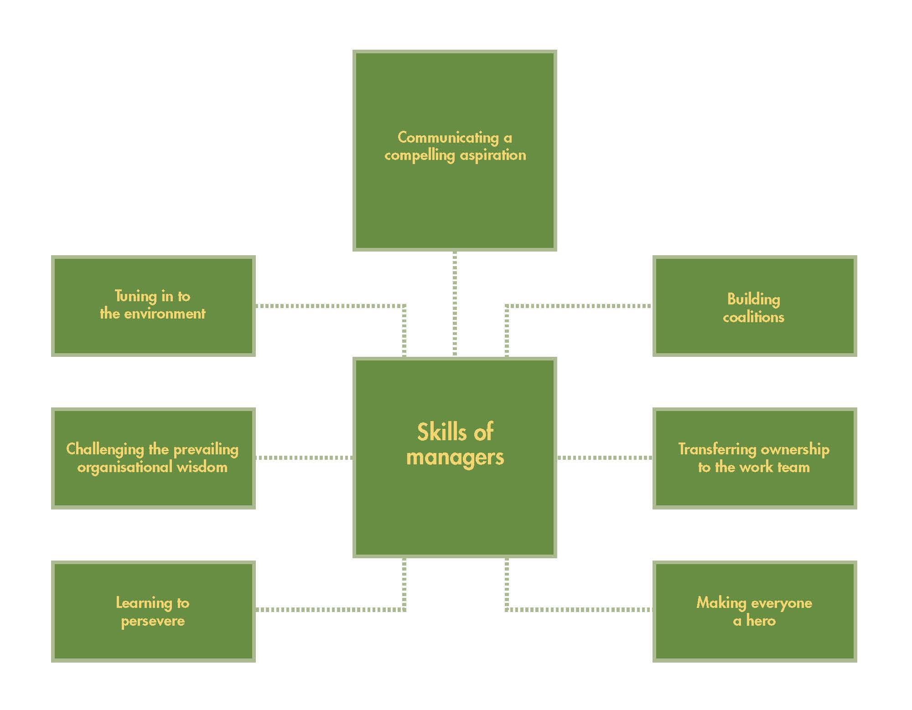
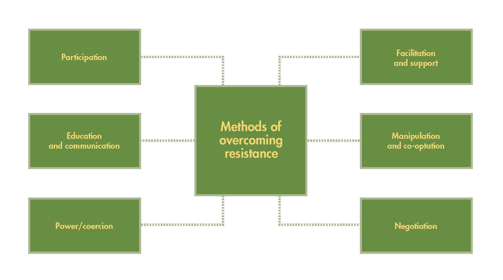
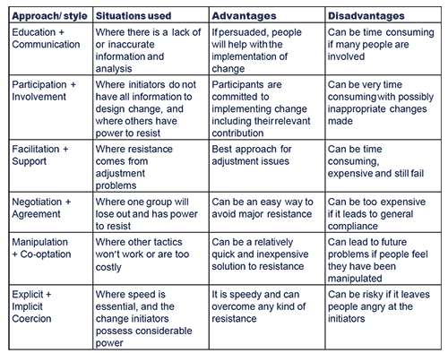

# Leading Change

Attributes of organizations that manage change successfully.

* The imagination to innovate.
* The professionalism to perform.
* The openness to collaborate.

Skills for leaders in change-adept organizations—skills identified by Kanter.

## Change is more likely to succeed if there is/are:

* clearly understandable goals,
* realistic time frames, rather than merely looking for a 'quick fix'
* clear guidance as to how each individual's behavior needs to change
* clear, unified leadership with no conflict between managers
* management support for training and other necessary investment.

## Leading the Change:

* **Tuning into the environment.** A leader can actively gather the information that might suggest new approaches by tuning in to what is happening in the environment. Leaders can create a network of 'listening posts,’ such as satellite offices and joint ventures.
* **Challenging the prevailing organizational wisdom.** Leaders should be able to look at matters from a different perspective and should not necessarily accept the current view of what is right or appropriate.
* **Communicating a compelling aspiration.** Leaders should have a clear vision of what they want to achieve and communicate it with conviction to the people they deal with. A manager cannot 'sell' change to other people without genuine conviction because there is usually too much resistance to overcome. Without conviction, a manager will not have the strength of leadership to persuade others.
* **Establishing a sense of urgency—** the change leader needs to help others see the need for change and convince them that it must be implemented promptly. Failure to create a sense of urgency leads to a lack of motivation from staff—the people who will ultimately implement the change you wish to create. Without motivation, they will not see the need to get involved, leading to failure. Therefore, this sense of urgency is vital and means that change leaders may take drastic action to create it. One manager commissioned his organization's first-ever customer satisfaction surveys, knowing the results would be adverse, and then made them public. This created a strong driving force for change within the organization.
* **Creating the guiding coalition—** the change leader is unlikely to be able to control the entire change process alone. They must therefore assemble a group with enough power to lead the change process and ensure they can act as a team. The coalition may not simply be formed from senior management, as it can include anyone with skills or knowledge which could be helpful in the change process. However, they will need sufficient power—whether through job titles or reputation, to accomplish the change and (where necessary) force it through against opposition.
* Change leaders need the support and involvement of other individuals with the resources, knowledge, or 'political clout' to make things happen. There are usually individuals within the organization who have the ability to influence others—'opinion shapers,’ 'values leaders', and experts in the field. Getting the support of these individuals calls for an understanding of the politics of change in organizations.
  * The change leader needs to be aware of the potential advantages and drawbacks of using a team to help implement change within the organization. Benefits include:
    * a mixture of skills and abilities within the team. Each member may be from a different part of the organization and may therefore have unique skills and knowledge that can be used to help the change process
    * better control, with opportunities for individual performance to be reviewed and controlled by other team members.
    * improved communication—can also lead to increased buy-in by the rest of the organization. For example, employees within the HR department are more likely to accept change if an HR staff member is part of the change team.
  * However, there are problems with the use of a team, including:
    * slower decision-making, as the discussion is needed to come to any agreement - also potentially leading to increased conflict
    * decisions may be compromises rather than decisions that are beneficial to the business and change process as a whole
    * group pressure to conform can lead to team members agreeing to a decision that they know is wrong because other team members support it
    * teams may have a lack of individual responsibility, as responsibility is shared between all members. They may therefore be more willing to take riskier courses of action than individuals.
* **Developing a change vision—** the change leader needs to create an overall vision of the future, illustrating what the change is designed to accomplish and its benefits. Strategies will be developed to achieve the proposed changes. Failure to develop a clear, concise vision that can be communicated to stakeholders means that the project can lack focus and goal congruence. The change management process may simply collapse into a series of conflicting projects that do not move the organization in the desired direction.
* **Communicating the vision—** the leader needs to communicate the vision and strategies identified in the previous stage to as many stakeholders as possible. This will maximize buy-in. Implementing major change in an organization requires the involvement of (potentially) many people at all levels. Without plenty of communication, these people will never see the importance of change and will be unwilling to make any effort towards accomplishing it.
* **Empowering broad-based action—** the change leader needs to remove obstacles to change (restraining forces) and encourage staff to get involved in generating ideas. Using Lewin's forcefield analysis (as earlier in this course) can be helpful. It helps management identify what will cause resistance so that plans can be created to deal with these issues.
* **Generating short-term wins—** plan for interim achievements that can easily be made visible, then publicize and reward staff members involved. Change processes can take a long time to implement—sometimes years. Most people will become demotivated if they do not see any changes within the short to mid-term. Without some short-term wins, they will become demotivated and cynical about the success of the change management process.
* **Never letting up—** maintain the change process, hiring, promoting, and developing employees who support and implement the required changes. The use of specific change agents may be helpful here (the role of change agents is explored later in this course). It is easy for an organization to believe its change process is complete when it has completed all relevant major projects. Unfortunately, as Lewin's three-stage model indicated earlier in the course, it is easy for staff to slip back into old habits and ways of working. Management will need to monitor the change process for a significant amount of time after 'completion' to ensure that the change has become permanent.
  * **Transferring ownership to the work team.** Leaders cannot introduce change on their own. At some stage, the responsibility for introducing change will be handed to others. Kanter suggested that a successful leader, having created a coalition in favor of the change, should enlist a team of other people to introduce the change.
  * **Learning to persevere.** Something will probably go wrong, and there will be setbacks. Change leaders should not give up too quickly but persevere with the change.
  * **Making everyone a hero.** A successful leader recognizes, rewards, and celebrates the accomplishments of others who have helped to introduce a change successfully. Making others feel appreciated for their contribution helps to sustain their motivation and their willingness to attempt further changes in the future.
* **Incorporating changes into the culture—** continually reinforce the change and communicate and reward achievement. This stage looks at ways to ensure that the new change is a standard part of everyday work and prevent staff from slipping back into their old habits. Management needs to ensure that they show staff how the changes have improved performance and how they have benefitted. It is also important to ensure that existing and future managers support the new processes. Choosing new managers who disagree with the changes could lead to staff slipping back into old habits and practices.

Kotter and Schlesinger set out the following change approaches to deal with resistance:

* Participation—aims to involve employees, usually by allowing some input into decision-making. This could easily result in employees enjoying raised levels of autonomy by allowing them to design their own jobs, pay structures, etc.
* Education and communication—used as a background factor to reinforce another approach. This strategy relies upon the hopeful belief that communication about the benefits of change to employees will result in their acceptance of the need to exercise the changes necessary.
* Power/coercion—involves the compulsory approach by management to implement change. This method finds its roots in management's formal authority and legislative support. This approach is often required where the speed of change needs to be rapid, and possible crises occur.
* Facilitation and support—employees may need to be counseled to help them overcome their fears and anxieties about change. Management may need to develop individual awareness of the need for change.
* Manipulation and co-optation—involves covert attempts to sidestep potential resistance. The disseminated information is selective and distorted to only emphasize the benefits of the change. Co-optation involves giving key people access to the decision-making process.
* Negotiation—is often practiced in unionized organizations. The negotiation process is exercised, enabling several parties with opposing interests to bargain. This bargaining leads to a situation of compromise and agreement.

