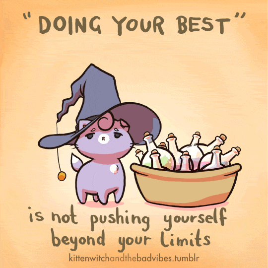
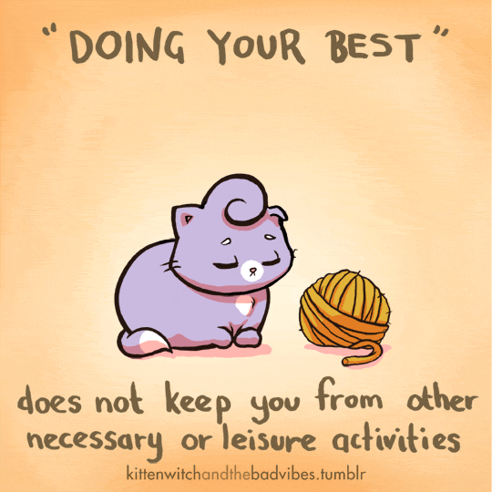
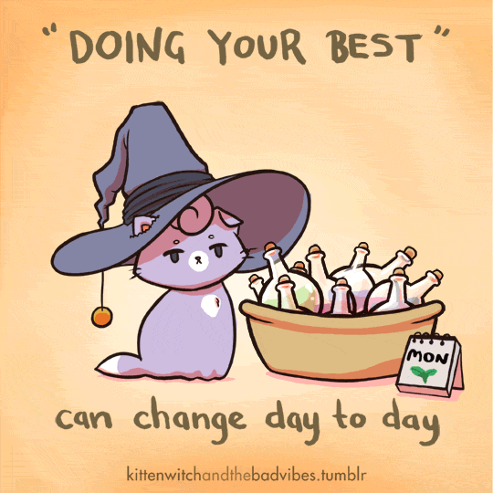
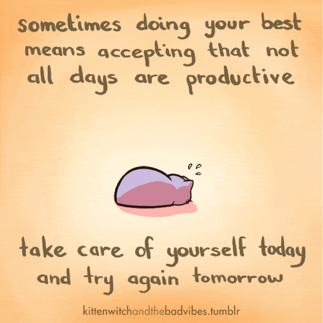

# Blog

Resources I find that I enjoy.

## August 18, 2023

I enjoyed this course, “Communicating through Disagreement”. Particularly the video on video on [Strategy Listening](https://www.linkedin.com/learning/communicating-through-disagreement-2022/strategic-listening-for-gaining-understanding?autoSkip=true&resume=false&u=2157642). It has a great tactic of what focus for while listening instead of being focused on how you want to respond:

* Issues and facts: What are they concerned about? Isolate only the facts as they see them.
* Feelings: Find the feeling that is beneath the words that they aren’t verbalizing
* Values: What is the value that has been violated. What value is the person protecting?
* Positions: Where does the person stand? What statement are they saying that indicates one of the other categories isn’t being fulfilled?

This course has a lot of other great tips, such as:
* Inquire with purpose
* [Using "Yes, and…" or "Interesting, and..."](https://www.linkedin.com/learning/communicating-through-disagreement-2022/setting-the-stage-for-agreement?resume=false&u=2157642) instead of Yes, but…
* I know what you believe, but [what do you need from me](https://www.linkedin.com/learning/communicating-through-disagreement-2022/what-do-they-need?autoSkip=true&resume=false&u=2157642) in this conversation?
* Using [“minimal encouragers”](https://www.linkedin.com/learning/communicating-through-disagreement-2022/learning-from-hostage-negotiators?autoSkip=true&resume=false&u=2157642) — small signs that you are listening.
* [Mirroring/repeating](https://www.linkedin.com/learning/communicating-through-disagreement-2022/learning-from-hostage-negotiators?autoSkip=true&resume=false&u=2157642) the person’s issue with a question — this volunteers more information.
* [Allow the person to save face](https://www.linkedin.com/learning/communicating-through-disagreement-2022/excelling-with-hostage-negotiation-tips?autoSkip=true&resume=false&u=2157642) — remark on how difficult the situation is.
* [Communicating through disagreement](https://www.linkedin.com/learning/communicating-through-disagreement-2022/sharpening-your-conflict-resolution-techniques?autoSkip=true&resume=false&u=2157642):
    * Recognize you could be wrong
    * Identify your objective
    * Summarize their stance
    * Listen to their opinion (see above!)
 
(disagreeing, management, meetings, listening)

## August 17, 2023

I just read this article from Harvard Business Review, [“How to have a good debate in the a meeting”](https://hbr.org/2018/01/how-to-have-a-good-debate-in-a-meeting). Here are a few strong opinions it had, but check out the article for the full context:

* **Start by asking a question, not uttering your opinion:** At a meeting, I attended as an adviser, the boss began with, “I think we should do X; what’s your opinion?” Everyone immediately agreed. For genuine discussion, start with a well-framed, unbiased question. This promotes real debate and encourages diverse perspectives.
* **Help quiet people speak up (and don’t let the talkers dominate):** Many hesitate to voice their opinions in meetings due to intimidation, fear, politics, or personality. However, their insights can be valuable. To involve them, consider “warm calling” before the meeting, prepping them to share their views--asking them to share a particular view before the meeting starts. Supporting their input during the meeting fosters a collaborative environment. Encouraging group discussions leverages collective wisdom, allowing for a richer exchange of ideas.
* **Make it safe for people to take risks:** Foster a climate of psychological safety where individuals feel free to share work-related thoughts and feelings. To create such a climate, lead by example (“Let me just throw out a risky idea...“); support those who try (“I really appreciate you suggesting...“); and sanction those who ridicule others (“I don’t want that kind of language here...“).
* **Play devil’s advocate:** ensure all options are explored, but be clear that is the role you are playing.
* **Cultivate transparent advocates:** When proposing ideas, be sure to be clear about the downsides of that idea.

(meetings, debate, listening)

## August 15, 2023

I’m obsessed with this week’s learning - asking questions to get to the core of an issue/“Inquire with purpose.” Rather than telling someone, “You need to…“or “You should…” it is about asking open-ended questions to resolve the topic or get more information. Making space for the other person to share their insights empowers them to own the outcome.

E.g., “What are possible directions you might consider?”

I particularly like the formula: Paraphrase + boundary + open-ended question (with plural noun).

* **Paraphrase:** Use the context of the situation to ensure the talker is heard.
* **Boundary** of the situation (“given our current budget...“).
* **Open-ended questions + plural noun:** Open-end are questions that lead to more than yes/no. Plural nouns being “ideas” rather than “idea”- “What ideas do you have for solving the problem?“). Use exploratory language to encourage new thoughts and viewpoints (might, if, could, consider, maybe, perhaps).

For example:
* “We have a lot of projects that could help us grow our team. Given our current budget situation, which of our projects is the highest priority?”
    * **Paraphrase:** We have a lot of projects that could help us grow our team
    * **Boundary:** Given our current budget situation
    * **Open-ended question:** which of our projects is the highest priority?
    * **Plural noun:** projects
* “If the funding is approved, what priorities could you focus on?”
    * **Boundary:** If the funding is approved
    * **Open-ended question:** what priorities could you focus on?
    * **Plural noun:** priorities
* "Considering that increased staffing is not an option right now, what other options have you considered?"*
    * **Boundary:** increased staffing is not an option
    * **Open-ended question:** what other options have you considered?
    * **Plural noun:** options
 
The person with the prompt challenges ownership in developing other options to mitigate the situation.

I also liked the **“tell me about it”** tactic for diagnosing an issue and letting people share their perspectives. Example: “Mia, I’ve noticed you have a number of reports on your desk that were scheduled to be finished and turned in last week. Tell me about it.”

(coaching, listening, management)

## August 12, 2023

I really like this article, [“Conversations That Unleash Employee Talent.”](Conversations_That_Unleash_Employee_Talent.pdf) It goes into the five conversations managers must be great at:
* Discuss what the employee needs to do.
* Discuss how employees are doing along the way to help them succeed.
* Discuss how the employee did.
* Discuss what the employee will get if he or she achieves the results.
* Discuss and help employees continue to develop.

It expands on the manager’s & employee’s role in the conversation, pitfalls, and best practices of each.

I particularly like the employee feedback-gathering suggestion: “If you were in my shoes and were to do this again, what would you do more or less of to be even more successful?”

Also, I enjoyed the should-not-be-hot-take: Managers who blindside employees in performance reviews should be fired because that means the manager has not been doing his or her job. These discussions should merely serve as uneventful summaries.

(coaching, management)

## August 8, 2023

The week’s homework is to learn about evident vs. judgment-based feedback. This week’s reading says to focus on the gaps in expected vs. actual performance and only communicate that information.
* Judgment - “Your document was unfinished and messy.”
* Evidence - “The document you committed to completing this sprint has pending comments. There is missing information from X service.”

One of the homework assignments was to approach a manager who gave a VERY judgment-based performance evaluation and create a plan on how to raise concerns. I liked this homework because it forced me to be in a situation where I had to give feedback on feedback. Here is my answer:

Greetings classmates!

The assignment requires providing feedback to my (Tyler’s) manager about the judgmental versus evidence-based evaluation. “Judgments include opinions or conclusions. Judgments are after-the-fact and based on your perception of the situation. When you judge an employee’s behavior, you assume what the person is doing and apply a general term to it. Evidence is providing judgment-free facts or data to support performance improvement. It is any statement based on information gathered informally or formally about something that can be seen, heard, measured, or counted.” (Green, 2013). The performance evaluation is full of judgment-based feedback. To identify a few:

* “Tyler seems to come to work late and shows up for meetings late.”
* “His style is somewhat sloppy.”
* “However, I think there have been times when he did not make himself available enough to team members.”

We are playing as Tyler, about to address his manager. I plan to address the performance evaluation in my meeting with my manager. My tactics are as follows:

* Ask if they are open to hearing my concerns regarding what was written in the performance evaluation. My manager might be having a bad day or be closed to the subject. Asking if they are open will ensure I’m not talking to a wall.
* Lead with behavior: I will address that their feedback does not focus on the gaps between the expectation and the actual performance. Moreover, the phrasing contains perception and opinion statements such as “I think…“, “Tyler seems…” and “somewhat…“.
* Eliminate judgment: The performance feedback, to be productive, must be focused on evidence, such as:
    * “The core working hours are 10 am-4 pm. Tyler has arrived at work at Xam Y amount of times.”
    * “Managers are expected to wear X, Y, and Z.”
    * “I have received written feedback from employees about their concerns with Tyler’s availability.”
* Be clear: Can the performance feedback be rewritten to identify the gaps in the expectation vs. actual performance? Evidenced-based feedback is essential because it helps me focus on my behaviors rather than what my manager thinks of me. Moreover, it helps reset my alignment with the performance expectation. “Evidence-based feedback is a tool that encourages self-assessment and accountability.” (Green, 2013).
* Inquire with purpose: What do you think?
* Align: Do we agree on the next steps? What is the timeline for the follow-up?

What do you all think of this approach? What are your strategies?

Best regards, Katherine Winter

**References**

Green, M. E. (2013). Painless performance conversations: A practical approach to critical day-to-day workplace discussions. Hoboken, NJ: John Wiley & Sons.

(feedback, coaching, management)

## July 15, 2023

**Meeting formula**

I read an article called [Driving Workplace Performance Through High-Quality Conversations](https://devddiwww.azurewebsites.net/research/driving-workplace-performance-through-high-quality-conversations). It had a range of topics regarding leadership conversation styles, but I particularly liked this breakdown of Interaction Guidelines. In my view, this should be the formula for most meetings (many do not):

* **OPEN:** Ensures that discussions have a clear purpose and that everyone understands the importance of accomplishing it.
* **CLARIFY:** There are two types of information to collect in this step—1) facts and figures, and 2) issues and concerns. Both are essential to building a complete picture of the situation.
* **DEVELOP:** When developing ideas, it is important to ask questions and include others in the process. Most likely, leaders will have ideas about what to do, and they should share them. However, they should put equal emphasis on seeking others’ ideas.
* **AGREE:** Leaders and the people involved in the conversation should agree on a plan for following through on the ideas that were developed and for supporting those who will take action.
* **CLOSE:** The final chance to check that everyone is clear on agreements and next steps and committed to following through.

## July 11, 2023

Here is a fun homework I had to do for my MBA class if anyone wants to do it for themselves:

Complete the [Conflict Styles Assessment](https://www.usip.org/public-education/students/conflict-styles-assessment) to determine your personal style. It is important for you to understand your personal conflict resolution style and be aware of it as you have difficult conversations.

Next, review the “Let’s Apply It” section in Chapter 2 called You’re an Avoider If... and complete the checklist of things that may have crossed your mind during a difficult work-related conversation.

Summarize the results of these tasks and conduct a self-analysis to determine whether you agree with the results. Post this summary and self-analysis to the discussion.

Then, respond to two of your classmate’s posts, comparing your style with theirs and evaluating their avoidance strategies.

## July 8, 2023

[I really like this article](https://hbr.org/2016/01/defusing-an-emotionally-charged-conversation-with-a-colleague) on handling emotionally charged conversations and utilizing the PEARLS approach. The article talks about how conversations can escalate fast when the task and relationship channel are mixed.

“task-focused disagreement becomes contaminated with concerns about our relationship. And when that happens, things escalate. Fast.”

PEARLS approach:

* Partnership:
  * “I really want to work on this with you.”
  * “I bet we can figure this out together.”
* Empathy:
  * “I can feel your enthusiasm as you talk.”
  * “I can hear your concern.”
* Acknowledgment:
  * “You clearly put a lot of work into this.”
  * “You invested in this, and it shows.”
* Respect:
  * “I’ve always appreciated your creativity.”
  * “There’s no doubt you know a lot about this.”
* Legitimation:
  * “This would be hard for anyone.”
  * “Who wouldn’t be worried about something like this?”
* Support:
  * “I’d like to help you with this.”
  * “I want to see you succeed.”

## June 28, 2023

I like the article [“Difficult Conversations: 9 common mistakes”](https://hbr.org/2010/10/difficult-conversations-9-common-mistakes) Particularly:

Mistake #5: We react to thwarting ploys.

“if your counterpart has stopped responding to you, you can simply say, “I don’t know how to interpret your silence.“”

## June 20, 2023

I enjoyed this article [How to Handle Difficult Conversations at Work](https://hbr.org/2015/01/how-to-handle-difficult-conversations-at-work)

Key takeaways for me:

* **Reframe thinking -** Don’t think of it negatively, but instead, a normal conversation about growth
* **Don’t make a script:** “Your strategy for the conversation should be “flexible” and contain “a repertoire of possible responses,”
* **Acknowledge your counterpart’s perspective:** “What is the problem? And, what does the other person think is the problem?” If you aren’t sure of the other person’s viewpoint, “acknowledge that you don’t know and ask,” Express your interest in understanding how the other person feels,” and “take time to process the other person’s words and tone,” he adds. Once you hear it, look for overlap between your point of view and your counterpart’s.
* **Give something back:** Proposing options “helps the other person see a way out, and it also signals respect.”
* **Slow down the pace of the conversation —** It helps you find the right words, and it signals to your counterpart that you’re listening

## March 21, 2023

**Strategy outline formula**

A strategy outline includes:

* the objectives
* the approach
* the process
* the expected outcomes

Example: "Our recommended acquisition strategy involves identifying and partnering with an organization that shares our vision of releasing our breast cancer treatment worldwide. By joining forces with an organization with a proven track record of successful global releases, we can continue focusing on developing more world-changing treatments. Achieving successful integration requires conducting meticulous due diligence and emphasizing iterative improvement. Altogether, this approach will ensure a successful partnership and the continued advancement of our shared goals."

The breakdown: the objectives (releasing breast cancer treatment worldwide), the approach (partnering with an organization with a proven track record), the process (due diligence and iterative improvement), and the expected outcomes (successful partnership and continued advancement of shared goals).

## March 20, 2023

Survey timing

I commonly have to send out surveys to get feedback from employees. I learned there is research behind the best time to send the survey [article](https://l.workplace.com/l.php?u=https%3A%2F%2Fwww.checkmarket.com%2Fblog%2Fsurvey-invitations-best-time-send%2F&h=AT2CMKkCNnSD3__AyT_dvkI3QhTz008pssYeG0RL3_C-_bm_UthEvajTPSNcUA4kIiQiwLQWOMrahpwkGnTiRqPsjFZSzlQmra22EgXmE2C-qhx2bQUQWIQ-ppezKaBzmKBrZg0kggmBgKOqpyYXRTOxNPuMRy4ck28&__tn__=-UK-R&c[0]=AT2xk2yszqiufvrB04oAox0S7H8j2Zb1L78lbnAq9DojT05jjxUTu3uQv8-sEq-G920qJbRsk6cLOvGQKRu8igUiGiANWjCTMAm3M0MtlouUabuNA_RP4kdh_98mqBfttPY6pnJj8dFKCLNjeeusDq4J4AyFqMd7mMOsHioKqNDi). Here is the TDLR:

* Mondays are the best to send out a B2B survey, no matter the length - between 3 and 6 o’clock
* Tuesday is the best day to send out short B2C surveys, while Fridays are the best days to send out long surveys. - between 5-10 PM.

## March 17, 2023

[Motivation, Productivity, and Change Management](https://l.workplace.com/l.php?u=https%3A%2F%2Fgithub.com%2FKatherineWinter%2Fkw_website%2Fblob%2Fmaster%2Fpublic%2Farticles%2Fteam_development%2FMotivation_Productivity_and_Change_Management.pdf&h=AT0V7qOTmyVOAQWP4-IOUynL0IHvWa68SEK_3L_UpfF3_9-V20euxDwhjAfWptl6CeLTzvUL_Aej-HClDpD8A6zkPGMkXjyk_7N1u9Go8HV2P0VYK7kxD27sICfa7wepyP2qUfsYGoO4i58yfa7IpQaR-63bd8eggVQ&__tn__=-UK-R&c[0]=AT27V3YsRk5h29V9C7No_Y0sUVetR5wOgegG2ZnG5_aXrj9JNRie6sMArT5lzUzPeV4kAwrdb8yeXDZl-kaypSWTnWrzl6GCfK1QMo7jW5MpsAa-cADy5dODEXk2nCz1spILAcBt7cajBH8XWaoo8bZ3m7mE8Bk4EwGGcowwV9Y0)

I particularly like this article on change management and motivation processes/theories. I had never heard of Victor Vrooms Expectancy theory, Equity theory, and Goal setting theories. Kotter’s change management process is everything. This article is a bit high-level, but it does a good job of “connecting the dots.”

## Feb 16, 2023

VIDEO: Optional L&L: [forecasting attrition % using multivariate regression & node](Optional_LL_forecasting_attrition_using_multivariate_regression_node.mp4)

## Feb 1, 2023

[This paper](Change_management_5_rules_for_building_a_world_class_guiding_coalition.pdf) talks about how to run a successful change coalition. TDLR 5 points:

1. The Dream Team
2. Change must trump ‘business as usual'
3. A fine balancing act
4. Keeping engagement alive
5. Keeping it simple

When you are the change leader, you have to make sure the mission/vision/why for the change is 100% clear

## Feb 1, 2023

I liked this LinkedIn learning course: [The Secret of Professional Networking (54m 25s)](https://www.linkedin.com/learning-login/share?account=2157642&forceAccount=false&redirect=https%3A%2F%2Fwww.linkedin.com%2Flearning%2Fsuper-connecting-the-secret-of-professional-networking%3Ftrk%3Dshare_ent_url%26shareId%3D5RyghXsEQMm4CwNyvYdgIw%253D%253D)

Some notes:

* Don’t attempt to be the most interesting person; be the most interested person.
  * Tell me more...
  * How come?
  * How did you come up with that?
* FORM questions
* Family
  * What is their personal history?
  * What is your family up to?
  *  Siblings? How has your relationship with them changed over the years?
  * Where are they from?
* Occupation
  * Tell me more about your job
  * How did you get into it?
  * How long have you been doing it?
  * Where do you think you can take it?
  * Is being in X everything you thought it would be?
* Recreation
  * What sorts of things do you do for fun?
  * What are some of your hobbies?
* Motivation
  * What gets you excited?
* Offer people your help, not your business pitch.
  * **Be a Go-Giver:** Offer people value on top of value.
* Put people’s numbers in your phone at the moment, not after the event. Follow up with a selfie with them.
* Look into a CRM - use automation. Reach out consistently. Don’t be bummed if they say no to an event. Follow up later. Update the notes on people.
* Make a list of things that make you uncomfortable and prep for them:
  * What can you anticipate?
  * How will you respond?
  * What questions will you ask?
* Use humor as a bridge - crafting humorous stories
  * Embarrassing situations
  * Frustrating situations
  * Laugh-out-loud situations
* Find a new event to attend every week
* Stand out
  * virtual coffee
  * action date (Zumba, hike, yoga, etc.)
  * walk-and-talk

## Jan 27, 2023

Happy Friday, everyone! My favorite comic for “I need a warm fuzzy now” is [“Kitten Witch and the Bad Vibes”](https://www.instagram.com/kittenwitchandthebadvibes/)

## Jan 7, 2023

**Invest in becoming an Emotional Intelligence (EQ) expert**

People with higher levels of emotional intelligence tend to be more successful in the workplace. The paper ["A time-lagged study of emotional intelligence and salary"](https://github.com/KatherineWinter/kw_website/blob/master/public/articles/team_development/a_time-lagged_study_of_emotional_intelligence_and_salary.pdf) backs that claim up with a 10-year research study of students entering corporate jobs. **"Emotional intelligence prior to having significant organizational leadership experience is related to subsequent career success, as measured by salary."**

While this study focuses on people entering the workforce, there is always time to develop EQ skills.

Individuals with high EQ are likely better at building relationships, leading teams, resolving conflicts, self-aware, self-regulation, and self-motivated, which can all lead to improved job performance and career advancement. By participating in emotional intelligence training, you can improve your career success.

[Here is a list of my favorite EQ resources.](https://github.com/KatherineWinter/kw_website/blob/master/public/articles/team_development/books.md)

[I recently watched this course, which has 12 quick EQ tactics.](https://www.linkedin.com/learning/emotional-intelligence-nano-tips-with-selena-rezvani/the-five-elements-of-emotional-intelligence?u=2157642)

## Jan 6, 2023

**Ensuring learning**

[This document](https://github.com/KatherineWinter/kw_website/blob/master/public/articles/team_development/ensuring_learning.pdf) covers how to design learning commitments for people who need to ensure that training is transferred to work. A “learning transfer design checklist” and scorecard are at the end.

Checklists and scorecards are a few of my favorite things.

## Jan 6, 2023

**The Five Practices and Ten Commitments of Exemplary Leadership**

[Lewis, L., Kouzes, J. M., & Posner, B. Z. (2021). Leading Organizational Change for Southern New Hampshire University. Wiley Global Education US.](https://wileyplus.vitalsource.com/books/9781119832591)

## Jan 4, 2023

I read from the book “Scaling Leadership” that “Leaders bring the weather”. However, I just read another passage from “Leading Organizational Change” that put action items to that phrase.

**Set the Example**

One of the toughest parts of being a leader is that you’re always on stage. People are always watching you, always talking about you, and always testing your credibility. That’s why setting the right example is so important, and why it’s essential to make use of all the tools you have available to do it.

Leaders send signals in a variety of ways, and constituents read them as indicators of what’s okay and what’s not okay to do. How you spend your time is the single best indicator of what’s important to you. Time is a precious asset because once passed, it is never recoverable. But if wisely invested, it can pay returns for years. The language you use and the questions you ask are other powerful ways to shape perceptions of what you value. You also need feedback to know if you’re doing what you say or sending mixed messages.

Be mindful that it’s not only what you do that matters. You are measured also by how consistent your constituents’ actions are with the shared values, so you must teach others how to set an example. Critical incidents—those chance occurrences in the lives of all organizations—offer significant teachable moments. They offer you the opportunity to pass along lessons in real time, not just in theory or the classroom. Critical incidents often become stories, and stories are among the most influential teaching tools you have. Remember that what you reinforce will be what receives the most attention. You have to keep score for people to know how they’re doing and to improve how they’re doing it. You also must reward the appropriate behavior if you expect people to repeat it.

To Model the Way, you must set the example by aligning actions with shared values. This means you must:

1. Keep your commitments and follow through on your promises.
1. Make sure your calendar, your meetings, your interviews, your emails, and all the other ways you spend your time reflect what you say is important.
1. Ask purposeful questions that keep people constantly focused on the values and priorities that are the most essential.
1. Broadcast examples of exemplary behavior through vivid and memorable stories that illustrate how people are and should be behaving.
1. Publicly ask for feedback from others about how your actions affect them.
1. Make changes and adjustments based on the feedback you receive; otherwise, people will stop bothering to provide it.

## Dec 15, 2022

How to improve your presentation - [work through these questions to help form your presentation narrative](https://github.com/KatherineWinter/kw_website/blob/master/public/articles/team_development/presentations.md)

## Dec 14, 2022

One of my school books, *Leading Organizational Change (Lewis)*, pointed out, that resistance to change is less strong if you first work on “change readiness” (ie. you get buy in that some kind of change needs to happen). Seems obvious, but I think it is more common to say (or I think I am more guilty of :smile: ):

“I think we should change X”

than

“X is not working — do you agree? Here is an idea of how we could change…” 

## Dec 5, 2022

I came across this in my MBA reading. I thought it was a pretty good example of timing of assessing outcomes and stakeholder perspectives:

**Timing of Assessing Outcomes**

One lesson from the snow‐shoveling example is that timing of assessment of any outcome can play a major role in how we judge what we have accomplished. This is as true of organizational dynamics as it is of snow removal. Many of the examples and cases discussed in this book thus far provide further evidence of the principle that achieved results change over time. The Spellings Commission would likely have judged the impact of its Report as failure at the outset since the immediate negative reaction of so many stakeholders was so strong. However, over the months that stakeholders discussed, debated, and reconsidered actions relative to the Report, results became more favorable. The higher education community began to work towards accomplishing some of the goals highlighted by the Report. The Commission started to see the fruits of its labor.

**Assessing Outcomes from Multiple Perspectives**

Not only is it hard to know when to assess outcomes, it is hard to know from what perspective to assess outcomes. To return to our snow example, when my kids were younger they would assess outcomes of snow in terms of (i) whether enough falls to get school canceled (good result), and (iii) whether enough snow falls to afford good sledding (also a good result). My husband and I are more concerned with how fast we can have our driveway cleared and how many times we have to shovel. The local snow removal service likely judges outcomes in terms of how much revenue the snowfall produces. From their perspective, a few moderate days of snowfall is superior to one day accumulating to the same number of inches. If they can charge for two visits to clear driveways, they are better off and can probably do their job more efficiently on each day, so they don’t have to pay workers for overtime.

## Dec 1, 2022

I watched this LinkedIn learning course for my MBA class. I thought it was insightful! Particularly the bit around a message can change depending on who delivers it.
[Communicate effectively in your organization - Organization Communication Video Tutorial | LinkedIn Learning, formerly Lynda.com](https://www.linkedin.com/learning/organization-communication/communicate-effectively-in-your-organization?autoplay=true&resume=false&u=2157642)

## Nov 29, 2022

From my class Leading Organization Change, I wrote down some notes that I think might be useful to help guide change. [Here is the link to the notes](leading_change_notes.md). **Start at section “Leading the change”**.

## Nov 18, 2022

**Tracking Development as a Leader**
I found this article that I like [“MEASURING THE UNMEASURABLE: TRACKING YOUR DEVELOPMENT AS A LEADER”](https://www.vantageleadership.com/our-blog/tracking-your-development-as-a-leader/), that shares these tips on tracking your development:

* Establish triggers and feedback mechanisms with an accountability buddy. ([Feedback buddies ftw!](https://blog.polleverywhere.com/feedback-buddies/))
* Keep a journal
* Realize your own perceptions are valuable data
* Remember that multiple measurement is best
